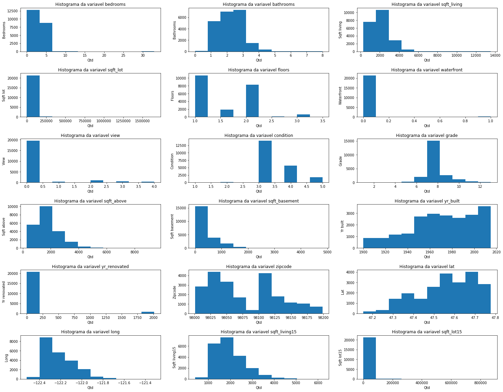
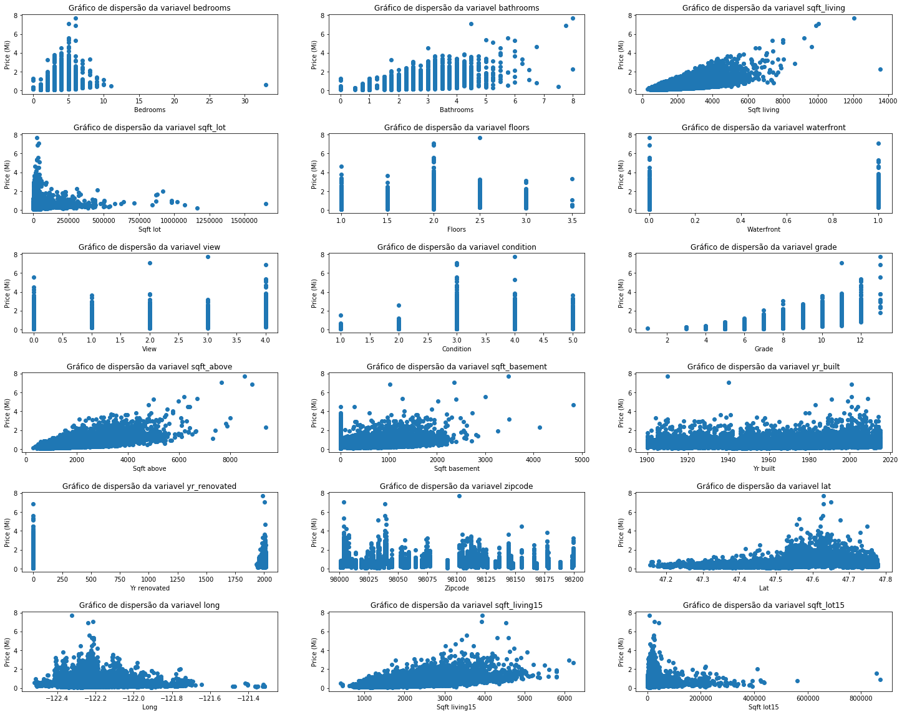

# Teste


```python
import numpy as np
import pandas as pd
import matplotlib.pyplot as plt
from sklearn import linear_model
import gmaps
```


```python
df = pd.read_csv('datasets/kc_house_data.csv')
variables = list(filter(lambda x: x not in ['price','id','date'],df))
variables
```


    ['bedrooms',
     'bathrooms',
     'sqft_living',
     'sqft_lot',
     'floors',
     'waterfront',
     'view',
     'condition',
     'grade',
     'sqft_above',
     'sqft_basement',
     'yr_built',
     'yr_renovated',
     'zipcode',
     'lat',
     'long',
     'sqft_living15',
     'sqft_lot15']


```python
df.head(5)
```


<div>
<style scoped>
    .dataframe tbody tr th:only-of-type {
        vertical-align: middle;
    }

    .dataframe tbody tr th {
        vertical-align: top;
    }

    .dataframe thead th {
        text-align: right;
    }
</style>
<table border="1" class="dataframe">
  <thead>
    <tr style="text-align: right;">
      <th></th>
      <th>id</th>
      <th>date</th>
      <th>price</th>
      <th>bedrooms</th>
      <th>bathrooms</th>
      <th>sqft_living</th>
      <th>sqft_lot</th>
      <th>floors</th>
      <th>waterfront</th>
      <th>view</th>
      <th>...</th>
      <th>grade</th>
      <th>sqft_above</th>
      <th>sqft_basement</th>
      <th>yr_built</th>
      <th>yr_renovated</th>
      <th>zipcode</th>
      <th>lat</th>
      <th>long</th>
      <th>sqft_living15</th>
      <th>sqft_lot15</th>
    </tr>
  </thead>
  <tbody>
    <tr>
      <th>0</th>
      <td>7129300520</td>
      <td>20141013T000000</td>
      <td>221900.0</td>
      <td>3</td>
      <td>1.00</td>
      <td>1180</td>
      <td>5650</td>
      <td>1.0</td>
      <td>0</td>
      <td>0</td>
      <td>...</td>
      <td>7</td>
      <td>1180</td>
      <td>0</td>
      <td>1955</td>
      <td>0</td>
      <td>98178</td>
      <td>47.5112</td>
      <td>-122.257</td>
      <td>1340</td>
      <td>5650</td>
    </tr>
    <tr>
      <th>1</th>
      <td>6414100192</td>
      <td>20141209T000000</td>
      <td>538000.0</td>
      <td>3</td>
      <td>2.25</td>
      <td>2570</td>
      <td>7242</td>
      <td>2.0</td>
      <td>0</td>
      <td>0</td>
      <td>...</td>
      <td>7</td>
      <td>2170</td>
      <td>400</td>
      <td>1951</td>
      <td>1991</td>
      <td>98125</td>
      <td>47.7210</td>
      <td>-122.319</td>
      <td>1690</td>
      <td>7639</td>
    </tr>
    <tr>
      <th>2</th>
      <td>5631500400</td>
      <td>20150225T000000</td>
      <td>180000.0</td>
      <td>2</td>
      <td>1.00</td>
      <td>770</td>
      <td>10000</td>
      <td>1.0</td>
      <td>0</td>
      <td>0</td>
      <td>...</td>
      <td>6</td>
      <td>770</td>
      <td>0</td>
      <td>1933</td>
      <td>0</td>
      <td>98028</td>
      <td>47.7379</td>
      <td>-122.233</td>
      <td>2720</td>
      <td>8062</td>
    </tr>
    <tr>
      <th>3</th>
      <td>2487200875</td>
      <td>20141209T000000</td>
      <td>604000.0</td>
      <td>4</td>
      <td>3.00</td>
      <td>1960</td>
      <td>5000</td>
      <td>1.0</td>
      <td>0</td>
      <td>0</td>
      <td>...</td>
      <td>7</td>
      <td>1050</td>
      <td>910</td>
      <td>1965</td>
      <td>0</td>
      <td>98136</td>
      <td>47.5208</td>
      <td>-122.393</td>
      <td>1360</td>
      <td>5000</td>
    </tr>
    <tr>
      <th>4</th>
      <td>1954400510</td>
      <td>20150218T000000</td>
      <td>510000.0</td>
      <td>3</td>
      <td>2.00</td>
      <td>1680</td>
      <td>8080</td>
      <td>1.0</td>
      <td>0</td>
      <td>0</td>
      <td>...</td>
      <td>8</td>
      <td>1680</td>
      <td>0</td>
      <td>1987</td>
      <td>0</td>
      <td>98074</td>
      <td>47.6168</td>
      <td>-122.045</td>
      <td>1800</td>
      <td>7503</td>
    </tr>
  </tbody>
</table>
<p>5 rows × 21 columns</p>
</div>


```python
len(df)
```


    21613


```python
df.dropna(inplace = True)
len(df)
```


    21613


```python
df.info()
```

    <class 'pandas.core.frame.DataFrame'>
    Int64Index: 21613 entries, 0 to 21612
    Data columns (total 21 columns):
    id               21613 non-null int64
    date             21613 non-null object
    price            21613 non-null float64
    bedrooms         21613 non-null int64
    bathrooms        21613 non-null float64
    sqft_living      21613 non-null int64
    sqft_lot         21613 non-null int64
    floors           21613 non-null float64
    waterfront       21613 non-null int64
    view             21613 non-null int64
    condition        21613 non-null int64
    grade            21613 non-null int64
    sqft_above       21613 non-null int64
    sqft_basement    21613 non-null int64
    yr_built         21613 non-null int64
    yr_renovated     21613 non-null int64
    zipcode          21613 non-null int64
    lat              21613 non-null float64
    long             21613 non-null float64
    sqft_living15    21613 non-null int64
    sqft_lot15       21613 non-null int64
    dtypes: float64(5), int64(15), object(1)
    memory usage: 3.5+ MB
    


```python
df.describe()
```


<div>
<style scoped>
    .dataframe tbody tr th:only-of-type {
        vertical-align: middle;
    }

    .dataframe tbody tr th {
        vertical-align: top;
    }

    .dataframe thead th {
        text-align: right;
    }
</style>
<table border="1" class="dataframe">
  <thead>
    <tr style="text-align: right;">
      <th></th>
      <th>id</th>
      <th>price</th>
      <th>bedrooms</th>
      <th>bathrooms</th>
      <th>sqft_living</th>
      <th>sqft_lot</th>
      <th>floors</th>
      <th>waterfront</th>
      <th>view</th>
      <th>condition</th>
      <th>grade</th>
      <th>sqft_above</th>
      <th>sqft_basement</th>
      <th>yr_built</th>
      <th>yr_renovated</th>
      <th>zipcode</th>
      <th>lat</th>
      <th>long</th>
      <th>sqft_living15</th>
      <th>sqft_lot15</th>
    </tr>
  </thead>
  <tbody>
    <tr>
      <th>count</th>
      <td>2.161300e+04</td>
      <td>2.161300e+04</td>
      <td>21613.000000</td>
      <td>21613.000000</td>
      <td>21613.000000</td>
      <td>2.161300e+04</td>
      <td>21613.000000</td>
      <td>21613.000000</td>
      <td>21613.000000</td>
      <td>21613.000000</td>
      <td>21613.000000</td>
      <td>21613.000000</td>
      <td>21613.000000</td>
      <td>21613.000000</td>
      <td>21613.000000</td>
      <td>21613.000000</td>
      <td>21613.000000</td>
      <td>21613.000000</td>
      <td>21613.000000</td>
      <td>21613.000000</td>
    </tr>
    <tr>
      <th>mean</th>
      <td>4.580302e+09</td>
      <td>5.400881e+05</td>
      <td>3.370842</td>
      <td>2.114757</td>
      <td>2079.899736</td>
      <td>1.510697e+04</td>
      <td>1.494309</td>
      <td>0.007542</td>
      <td>0.234303</td>
      <td>3.409430</td>
      <td>7.656873</td>
      <td>1788.390691</td>
      <td>291.509045</td>
      <td>1971.005136</td>
      <td>84.402258</td>
      <td>98077.939805</td>
      <td>47.560053</td>
      <td>-122.213896</td>
      <td>1986.552492</td>
      <td>12768.455652</td>
    </tr>
    <tr>
      <th>std</th>
      <td>2.876566e+09</td>
      <td>3.671272e+05</td>
      <td>0.930062</td>
      <td>0.770163</td>
      <td>918.440897</td>
      <td>4.142051e+04</td>
      <td>0.539989</td>
      <td>0.086517</td>
      <td>0.766318</td>
      <td>0.650743</td>
      <td>1.175459</td>
      <td>828.090978</td>
      <td>442.575043</td>
      <td>29.373411</td>
      <td>401.679240</td>
      <td>53.505026</td>
      <td>0.138564</td>
      <td>0.140828</td>
      <td>685.391304</td>
      <td>27304.179631</td>
    </tr>
    <tr>
      <th>min</th>
      <td>1.000102e+06</td>
      <td>7.500000e+04</td>
      <td>0.000000</td>
      <td>0.000000</td>
      <td>290.000000</td>
      <td>5.200000e+02</td>
      <td>1.000000</td>
      <td>0.000000</td>
      <td>0.000000</td>
      <td>1.000000</td>
      <td>1.000000</td>
      <td>290.000000</td>
      <td>0.000000</td>
      <td>1900.000000</td>
      <td>0.000000</td>
      <td>98001.000000</td>
      <td>47.155900</td>
      <td>-122.519000</td>
      <td>399.000000</td>
      <td>651.000000</td>
    </tr>
    <tr>
      <th>25%</th>
      <td>2.123049e+09</td>
      <td>3.219500e+05</td>
      <td>3.000000</td>
      <td>1.750000</td>
      <td>1427.000000</td>
      <td>5.040000e+03</td>
      <td>1.000000</td>
      <td>0.000000</td>
      <td>0.000000</td>
      <td>3.000000</td>
      <td>7.000000</td>
      <td>1190.000000</td>
      <td>0.000000</td>
      <td>1951.000000</td>
      <td>0.000000</td>
      <td>98033.000000</td>
      <td>47.471000</td>
      <td>-122.328000</td>
      <td>1490.000000</td>
      <td>5100.000000</td>
    </tr>
    <tr>
      <th>50%</th>
      <td>3.904930e+09</td>
      <td>4.500000e+05</td>
      <td>3.000000</td>
      <td>2.250000</td>
      <td>1910.000000</td>
      <td>7.618000e+03</td>
      <td>1.500000</td>
      <td>0.000000</td>
      <td>0.000000</td>
      <td>3.000000</td>
      <td>7.000000</td>
      <td>1560.000000</td>
      <td>0.000000</td>
      <td>1975.000000</td>
      <td>0.000000</td>
      <td>98065.000000</td>
      <td>47.571800</td>
      <td>-122.230000</td>
      <td>1840.000000</td>
      <td>7620.000000</td>
    </tr>
    <tr>
      <th>75%</th>
      <td>7.308900e+09</td>
      <td>6.450000e+05</td>
      <td>4.000000</td>
      <td>2.500000</td>
      <td>2550.000000</td>
      <td>1.068800e+04</td>
      <td>2.000000</td>
      <td>0.000000</td>
      <td>0.000000</td>
      <td>4.000000</td>
      <td>8.000000</td>
      <td>2210.000000</td>
      <td>560.000000</td>
      <td>1997.000000</td>
      <td>0.000000</td>
      <td>98118.000000</td>
      <td>47.678000</td>
      <td>-122.125000</td>
      <td>2360.000000</td>
      <td>10083.000000</td>
    </tr>
    <tr>
      <th>max</th>
      <td>9.900000e+09</td>
      <td>7.700000e+06</td>
      <td>33.000000</td>
      <td>8.000000</td>
      <td>13540.000000</td>
      <td>1.651359e+06</td>
      <td>3.500000</td>
      <td>1.000000</td>
      <td>4.000000</td>
      <td>5.000000</td>
      <td>13.000000</td>
      <td>9410.000000</td>
      <td>4820.000000</td>
      <td>2015.000000</td>
      <td>2015.000000</td>
      <td>98199.000000</td>
      <td>47.777600</td>
      <td>-121.315000</td>
      <td>6210.000000</td>
      <td>871200.000000</td>
    </tr>
  </tbody>
</table>
</div>


```python
histograms = plt.figure(figsize=(25,20))
plt.subplots_adjust(wspace=0.2,hspace=0.5)
for idx,variable in enumerate(variables):
    plot = histograms.add_subplot(6,3,idx+1)
    plot.set(xlabel='Qtd',ylabel=variable.replace('_',' ').capitalize(),title='Histograma da variavel %s' %variable)
    plot.hist(df[variable])

```





```python
scatters = plt.figure(figsize=(25,20))
plt.subplots_adjust(wspace=0.2,hspace=0.5)
for idx,variable in enumerate(variables):
    plot = scatters.add_subplot(6,3,idx+1)
    plot.set(ylabel='Price (Mi)',xlabel=variable.replace('_',' ').capitalize(),title='Gráfico de dispersão da variavel %s' %variable)
    plot.scatter(df[variable],df.price/10**6)
scatters
        
```





```python
def getCorrCoeff(X,Y):
    assert len(X) == len(Y)
    n = len(X)
    X_mean = np.mean(X)
    Y_mean = np.mean(Y)
    
    S_XY = sum(X * Y) - n * X_mean * Y_mean
    S_XX = sum(X ** 2) - n * X_mean ** 2
    S_YY = sum(Y ** 2) - n * Y_mean ** 2
    return S_XY / (np.sqrt(S_XX) * np.sqrt(S_YY))

corrList = sorted(((key,getCorrCoeff(df.price,df[key])) for key in filter(lambda x: x not in ['price','id','zipcode','date'], df)), key = lambda x: x[1], reverse = True)
corrList

```


    [('sqft_living', 0.7020350546118023),
     ('grade', 0.6674342560202396),
     ('sqft_above', 0.6055672983560803),
     ('sqft_living15', 0.58537890357957),
     ('bathrooms', 0.5251375054139634),
     ('view', 0.3972934882945054),
     ('sqft_basement', 0.3238160207119849),
     ('bedrooms', 0.3083495981456395),
     ('lat', 0.3070034800541197),
     ('waterfront', 0.26636943403060287),
     ('floors', 0.25679388755071914),
     ('yr_renovated', 0.12643379344089334),
     ('sqft_lot', 0.08966086058710039),
     ('sqft_lot15', 0.08244715251948619),
     ('yr_built', 0.054011531494792674),
     ('condition', 0.036361789128997554),
     ('long', 0.02162624109343077)]


```python
correlationList = sorted([(variable,np.corrcoef(df.price,df[variable])[1,0]) for variable in variables],key=lambda x: x[1],reverse=True)
pd.DataFrame(correlationList, columns='Variable CorrCoef'.split())
```


<div>
<style scoped>
    .dataframe tbody tr th:only-of-type {
        vertical-align: middle;
    }

    .dataframe tbody tr th {
        vertical-align: top;
    }

    .dataframe thead th {
        text-align: right;
    }
</style>
<table border="1" class="dataframe">
  <thead>
    <tr style="text-align: right;">
      <th></th>
      <th>Variable</th>
      <th>CorrCoef</th>
    </tr>
  </thead>
  <tbody>
    <tr>
      <th>0</th>
      <td>sqft_living</td>
      <td>0.702035</td>
    </tr>
    <tr>
      <th>1</th>
      <td>grade</td>
      <td>0.667434</td>
    </tr>
    <tr>
      <th>2</th>
      <td>sqft_above</td>
      <td>0.605567</td>
    </tr>
    <tr>
      <th>3</th>
      <td>sqft_living15</td>
      <td>0.585379</td>
    </tr>
    <tr>
      <th>4</th>
      <td>bathrooms</td>
      <td>0.525138</td>
    </tr>
    <tr>
      <th>5</th>
      <td>view</td>
      <td>0.397293</td>
    </tr>
    <tr>
      <th>6</th>
      <td>sqft_basement</td>
      <td>0.323816</td>
    </tr>
    <tr>
      <th>7</th>
      <td>bedrooms</td>
      <td>0.308350</td>
    </tr>
    <tr>
      <th>8</th>
      <td>lat</td>
      <td>0.307003</td>
    </tr>
    <tr>
      <th>9</th>
      <td>waterfront</td>
      <td>0.266369</td>
    </tr>
    <tr>
      <th>10</th>
      <td>floors</td>
      <td>0.256794</td>
    </tr>
    <tr>
      <th>11</th>
      <td>yr_renovated</td>
      <td>0.126434</td>
    </tr>
    <tr>
      <th>12</th>
      <td>sqft_lot</td>
      <td>0.089661</td>
    </tr>
    <tr>
      <th>13</th>
      <td>sqft_lot15</td>
      <td>0.082447</td>
    </tr>
    <tr>
      <th>14</th>
      <td>yr_built</td>
      <td>0.054012</td>
    </tr>
    <tr>
      <th>15</th>
      <td>condition</td>
      <td>0.036362</td>
    </tr>
    <tr>
      <th>16</th>
      <td>long</td>
      <td>0.021626</td>
    </tr>
    <tr>
      <th>17</th>
      <td>zipcode</td>
      <td>-0.053203</td>
    </tr>
  </tbody>
</table>
</div>


```python
factor = int(len(df)*0.9)
X = df[['sqft_living','lat','waterfront','floors']]
y = df['price']
train = X[:factor]
train_y = y[:factor]
test = X[factor:]
test_y = y[factor:]
reg = linear_model.LinearRegression()
reg.fit(train,train_y)
```


    LinearRegression(copy_X=True, fit_intercept=True, n_jobs=None, normalize=False)


```python
reg.intercept_
```


    -33680920.8109299


```python
reg.coef_
```


    array([2.68033152e+02, 7.07660741e+05, 8.31113848e+05, 1.35746313e+03])


```python
train[3:6]
```


<div>
<style scoped>
    .dataframe tbody tr th:only-of-type {
        vertical-align: middle;
    }

    .dataframe tbody tr th {
        vertical-align: top;
    }

    .dataframe thead th {
        text-align: right;
    }
</style>
<table border="1" class="dataframe">
  <thead>
    <tr style="text-align: right;">
      <th></th>
      <th>sqft_living</th>
      <th>lat</th>
      <th>waterfront</th>
      <th>floors</th>
    </tr>
  </thead>
  <tbody>
    <tr>
      <th>3</th>
      <td>1960</td>
      <td>47.5208</td>
      <td>0</td>
      <td>1.0</td>
    </tr>
    <tr>
      <th>4</th>
      <td>1680</td>
      <td>47.6168</td>
      <td>0</td>
      <td>1.0</td>
    </tr>
    <tr>
      <th>5</th>
      <td>5420</td>
      <td>47.6561</td>
      <td>0</td>
      <td>1.0</td>
    </tr>
  </tbody>
</table>
</div>


```python
reg.predict(train[3:6])
```


    array([ 474386.17658794,  467272.32520681, 1497527.3803962 ])


```python
train_y[3:6]
```


    3     604000.0
    4     510000.0
    5    1225000.0
    Name: price, dtype: float64


```python
reg.score(test,test_y)
```


    0.6267720881507608


```python
coords = df[['lat','long']]
gmaps.configure(api_key=KEY)

figure_layout = {
    'width': '800px',
    'height': '800px',
    'border': '1px solid black',
    'padding': '1px'
}

fig = gmaps.figure(layout=figure_layout)


heatmap_layer = gmaps.heatmap_layer(coords)
fig.add_layer(heatmap_layer)
fig


```


    Figure(layout=FigureLayout(border='1px solid black', height='800px', padding='1px', width='800px'))


```python
figure_layout = {
    'width': '800px',
    'height': '800px',
    'border': '1px solid black',
    'padding': '1px'
}

fig = gmaps.figure(map_type='SATELLITE',layout=figure_layout)

heatmap_layer = gmaps.heatmap_layer(coords,weights=df['price'])
fig.add_layer(heatmap_layer)
fig
```


    Figure(layout=FigureLayout(border='1px solid black', height='800px', padding='1px', width='800px'))


```python
heatmap_layer.dissipating = True
```


```python

```
